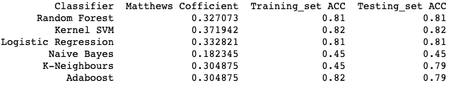

# Credit-Card-Payment-Default
Using ML models to detect if a customer is likely to default his next credit card payment
## PROBLEM 
    Our client is a Credit card comapny in Taiwan. They wanted to know if we can predict whether a customer will default his next credit card payment.
## My Goal
    Goal is to develop a Machine Learning model to predict whether an account will default next month, given demographics and historical data.  
### Data Source : https://archive.ics.uci.edu/ml/datasets/default+of+credit+card+clients
## Process steps in developing and evaluating the ML model to address the problem.
### 1 : ___Data Cleaning/ Exploratory Data Analysis (EDA)___
    a. Loaded the client data which is an excel file.
    b. Part of checking the integrity of data, we removed duplicate customer unique IDS which had a value of 0 for the other columns. This could probably be an error while data          extraction.
    c. Dropped rows with "Not Available" values in Pay_1(September month payment) column and also Pay_2 to Pay_6 due to nonsensical/imperfect information.
    d. Looked at general distribution of the variables.
    e. Common features noted are: Average customer credit balance is NT$167919.05, Average age of customers is 35.5 yrs, which consisted of 60.3% Females and 39.7 % males.
    f: Final cleaned dataset consisted of 2665 unique customer IDs(rows) and 18 features(columns) which will be used for data modelling.

### 2 : ___Data Modelling___
    a. Applied Univariate Feature Selection using ANOVA F-test and P-values.
    b. Used One Hot Encoding(OHE), a technique of Feature Engineering to extract new features from the Education column.
    c. Used standad scalar to transform the data.
    d. We used cross validation method for training the data.
    

___***This is a binary classification problem, wherein we have only two outcomes ie. Default (YES = 1 or NO = 0).***___  So, we use different classification models to predict the desired outcome.

### 3 : ___Evaluation of the results___
   This dataset is hightly ***imbalanced***. Hence using accuracy as the only metric is not advisable. So in order to select the right model, we use ***Matthews Correlation          Coefficient*** as a metric to better evaluate the performance of our model. The results are given below:

## Conclusion
   We can see that the accuracy for ***Kernel SVM is 0.82*** , which is higher than the other models. Moreover, the accuracy scores between the train and test data are same which    indicates that there is neither overfitting or underfitting. Since this dataset is imbalanced, it is good to take into consideration the Matthews Correlation Coefficient. This    score of ***0.33 is also the highest for Kernel SVM.*** Hence we can conclude that Kernel SVM is the ***best model*** that we recommend. Next to be considered is Logistic          Regression.

Reference: Data Science Projects with Python by Stephen Klosterman, 2019 , Packt Publishing
